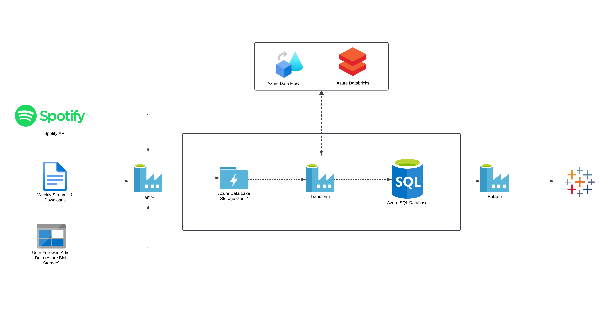
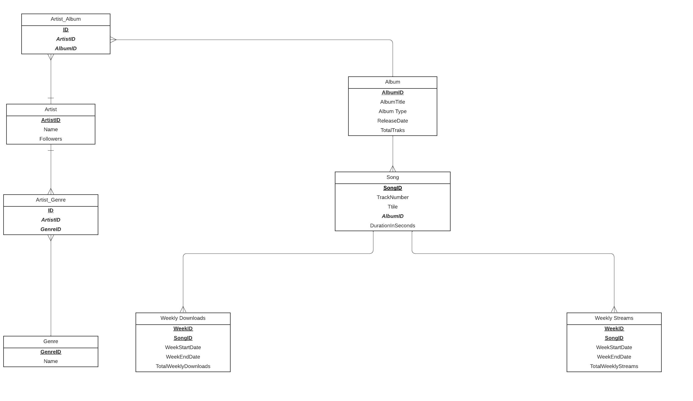

# ETL Pipeline for Music Database

## Purpose

The primary purpose of this ETL pipeline is to reinforce the foundational data principles acquired through self-study, my master's program and practical internship experience. Drawing on the knowledge and skills developed, the project aims to apply these principles to the real-world scenario of building a music database. By extracting, transforming, and loading data from Spotify's API, the pipeline serves as a hands-on application of data management concepts. This project is a steppingstone to solidify my understanding of data processing, analytics, and storage.
## Prerequisites

## Scope and Goals

The scope of the project encompasses the end-to-end process of constructing a music database, starting from the extraction of artist data from Spotify, including details like discography, albums, songs, followers, and genres. The goal is not only to create a functional ETL pipeline but also to deepen my understanding of Microsoft Azure, a key technology in the contemporary data landscape. Achieving this involves successfully implementing and optimizing the data pipeline, incorporating Azure services as needed. The overarching objective is to gain practical expertise in designing, building, and maintaining an effective data pipeline, contributing to my overall proficiency in the realm of data engineering and analytics.

## Tools and Technologies Used

### A. List of Technologies
- **Azure Data Factory:** For orchestrating workflows
- **Azure Dataflows:** For efficient data transformations
- **Azure Databricks:** For advanced processing capabilities
- **Azure SQL:** For detailed analysis, utilizing Azure's relational database service
- **Tableau:** For visualizing and reporting insights
- **Python scripting:** For specific functionalities

### B. Justification for Selecting Each Tool

My decision to exclusively utilize Azure services stems from a deeply personal motivation – the pursuit of the Azure Data Engineering Associate certification. By immersing myself in Azure Data Factory, Dataflows, Databricks, and SQL, I ensure seamless integration within the Azure environment. This strategic choice aligns with the specific objectives of the certification, contributing not only to a comprehensive understanding of Azure's data services but also to the practical application of this knowledge within a real-world project.


## Architecture Diagram



The architecture diagram illustrates the flow and integration of various components in the ETL pipeline.

## ER Diagram



The ER diagram showcases the relationships between different entities in the music database schema.

Before running the ETL pipeline, make sure you have the necessary dependencies installed. You can install them using the following commands:

```bash
pip install spotipy  # Python library for Spotify API
# Add other dependencies as needed
```
## Data Extraction
### Source of Data
Data is sourced from Spotify's API and a custom Python script generating fictional values for song streams and downloads.

Data Extraction Code

#### User-Followed Artist Data

```bash
import spotipy
from spotipy.oauth2 import SpotifyOAuth
import json

def fetch_and_save_followed_artists(client_id, client_secret, redirect_uri, scope):
    sp = spotipy.Spotify(auth_manager=SpotifyOAuth(
        client_id=client_id,
        client_secret=client_secret,
        redirect_uri=redirect_uri,
        scope=scope
    ))

    all_artists = sp.current_user_followed_artists(limit=20, after=None)

    with open('followed_artists_list.json', 'a', encoding='utf-8') as file:
        artist_info = all_artists['artists']
        json.dump(artist_info, file, ensure_ascii=False)
        file.write('\n')

def main():
    # Replace <your_client_id>, <your_client_secret>, <your_redirect_uri> with your actual Spotify application credentials
    client_id = "<your_client_id>"
    client_secret = "<your_client_secret>"
    redirect_uri = "<your_redirect_uri>"
    scope = "user-follow-read"

    fetch_and_save_followed_artists(client_id, client_secret, redirect_uri, scope)
    print("Done")

if __name__ == "__main__":
    main()
```

#### Albums and Tracks

## Workflow Automation

The pipeline operates with two triggers, adding a layer of automation to the overall process. The first trigger initiates the creation of the database when the file containing followed artists' data is placed into Blob Storage. 

``` bash
{
    "name": "tr_followed_artist_data_arrived",
    "properties": {
        "description": "The "tr_followed_artist_data_arrived" trigger is a Blob Events Trigger that triggers the "pl_execute_all" pipeline when new blobs are created in the "/followed-artist-data/blobs/followed_artists_list.json" path within the specified Azure Storage account. ",
        "annotations": [],
        "runtimeState": "Started",
        "pipelines": [
            {
                "pipelineReference": {
                    "referenceName": "pl_execute_all",
                    "type": "PipelineReference"
                }
            }
        ],
        "type": "BlobEventsTrigger",
        "typeProperties": {
            "blobPathBeginsWith": "/followed-artist-data/blobs/followed_artists_list.json",
            "ignoreEmptyBlobs": true,
            "scope": "<your_subscription>",
            "events": [
                "Microsoft.Storage.BlobCreated"
            ]
        }
    }
}
```

The second trigger is activated at the end of each week when the weekly song data (streams and downloads) is received. This subsequent trigger facilitates the execution of specific ETL processes, updating the respective tables for weekly streams and weekly downloads

``` bash
{
    "name": "tr_weekly_track_data_arrived",
    "properties": {
        "description": "\nThe \"tr_weekly_track_data_arrived\" trigger is set to activate the \"pl_weekly_streams_pipeline\" when new blobs are created in the \"/incoming-streams/blobs/\" path of the Azure Storage account.",
        "annotations": [],
        "runtimeState": "Started",
        "pipelines": [
            {
                "pipelineReference": {
                    "referenceName": "pl_weekly_streams_pipeline",
                    "type": "PipelineReference"
                }
            }
        ],
        "type": "BlobEventsTrigger",
        "typeProperties": {
            "blobPathBeginsWith": "/incoming-streams/blobs/",
            "ignoreEmptyBlobs": true,
            "scope": "<your_subscription>",
            "events": [
                "Microsoft.Storage.BlobCreated"
            ]
        }
    }
}
```

## Challenges Faced

During the development of the ETL pipeline, I encountered several challenges that tested my problem-solving skills and adaptability. While the specifics might not be remembered in detail, I can outline the general types of challenges faced:


### Authentication with Spotify API

The challenge of integrating OAuth for user-followed artist data extraction led to a thoughtful solution. Utilizing the spotipy library in Python, I implemented a local extraction process. This involved initiating the OAuth flow locally, authenticating the requests, and obtaining the necessary data from Spotify. The extracted data was then conveniently transferred to Azure Blob Storage, creating a bridge between the local extraction process and the broader Azure environment. This approach not only addressed the initial hurdle posed by Spotify's OAuth control flow but also provided a seamless transition for the data to be ingested into the Azure ecosystem. The use of the spotipy library played a crucial role in simplifying the authentication process, showcasing the adaptability and resourcefulness employed during the development of the ETL pipeline.

### Efficient Handling of Album and Track Data

The efficient ingestion of album and track data became a focal point during the development of the ETL pipeline. Initially relying solely on Data Factory's web activities for ingesting albums and tracks proved to be inefficient, especially when dealing with a substantial number of artists and their entire discographies.

### Recognizing the Challenge

As the project evolved, I encountered a significant challenge related to the request limits imposed by Spotify's API. While Spotify's documentation mentioned a 429 error for too many requests within a rolling 30-second window, practical testing revealed that I consistently reached this error after approximately 5000 requests per endpoint. This limitation posed a substantial hurdle, especially given the extensive list of 121 artists for whom I aimed to retrieve entire discographies.

### Addressing the Challenge

In response to this challenge, I pivoted to using Azure Databricks as it offered a more scalable solution. However, the request limit persisted, and I needed a strategic workaround to ensure the complete extraction of data without encountering the 429 error regularly.

### Implementing a Retry-After Solution

Within Azure Data Factory, I implemented a Retry-After solution. Upon reaching the request limit, I configured the pipeline to wait until the specified retry-after time period had elapsed, which, in this case, was approximately 24 hours. This strategic approach allowed the extraction process to resume after the waiting period, effectively bypassing the limitations imposed by Spotify's API.

### Navigating the Lack of Bulk Track Endpoint

One noteworthy challenge was the absence of a bulk track endpoint in Spotify's API. Given the absence of such an endpoint, the Retry-After solution became a pragmatic choice to manage the data extraction process for a considerable number of artists. This adaptive approach to handling API limitations and leveraging the Retry-After solution demonstrates the practical considerations made during the development of the ETL pipeline, highlighting problem-solving skills and resourcefulness in the face of real-world challenges.

### Learning Curve with New Technologies

Working extensively with Databricks, Azure Data Factory, and OAuth control flow presented a steep learning curve. However, this challenge was tackled through dedicated learning and hands-on practice.

## Conclusion

In achieving my goal of creating a project entirely within the Azure ecosystem, I successfully developed a functional pipeline to the best of my current knowledge. The project's primary outcome was the creation of a working music database, extracted from Spotify's API and supplemented with fictional streaming and download data. While the pipeline is operational, I recognize the potential for ongoing improvements and expansions. There is ample room for enhancement, and envisioning the addition of user profiles and playlist generation is a promising avenue for future development. Such expansions could open the door to addressing business-related queries, aligning with the schema established within the database. The project, as it currently stands, serves as a foundation, and there are numerous possibilities for growth and refinement.


## Key Learnings

1. **Databricks:** Gained valuable experience in working with Databricks, leveraging its capabilities for efficient data transformation and processing.
2. **Orchestrating in Azure Data Factory:** The project reinforced my understanding of orchestrating workflows in Azure Data Factory, a crucial skill for managing end-to-end data pipelines.
3. **SQL Reinforcement:** The usage of Azure SQL for data storage provided an opportunity to reinforce SQL skills, particularly in the context of a real-world project.
4. **Working with APIs:** Interacting with Spotify's API introduced me to the intricacies of API usage, including authentication and data extraction.
5. **Understanding ETL:** The project deepened my comprehension of ETL (Extract, Transform, Load) processes, emphasizing their significance in data engineering.

